# Garmin Fancyfonts Time

A minimalist, elegant, nerdy, typography-focused Garmin Connect IQ watch face that displays the current time using a variety of beautiful fonts..

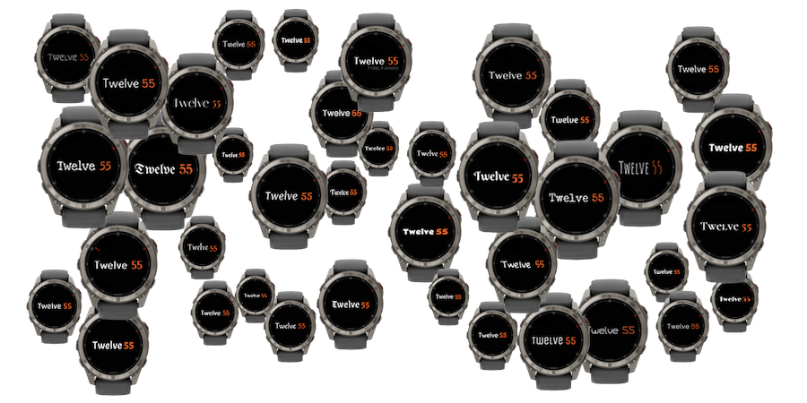

Available from [Garmin Connect IQ Developer portal](https://apps.garmin.com/apps/{blank:app-id}) or through the Connect IQ mobile app.

> **Note**  
> Fancyfonts Time is part of a [collection of unconventional Garmin watch faces](https://github.com/wkusnierczyk/garmin-watch-faces). It has been developed for fun, as a proof of concept, and as a learning experience.
> It is shared _as is_ as an open source project, with no commitment to long term maintenance and further feature development.
>
> Please use [issues](https://github.com/wkusnierczyk/garmin-fancyfonts-time/issues) to provide bug reports or feature requests.  
> Please use [discussions](https://github.com/wkusnierczyk/garmin-fancyfonts-time/discussions) for any other comments.
>
> All feedback is wholeheartedly welcome.

## Contents

* [Fancyfonts time](#fancyfonts-time)
* [Features](#features)
* [Fonts](#fonts)
* [Build, test, deploy](#build-test-deploy)

## Fancyfonts Time

Famcyfonts Time is a watch face for font lovers.
It shows the time as a word for hours and digits for minutes, e.g., `Twelve 17`.
It is equipped with a variety of fonts that can be choosen from in the customisation menu.

## Features

The Fancyfonts Time watch face supports the following features:

|Screenshot|Description|
|-|:-|
||**Time as word and digits**<br/> The watch face shows time as a capitalised English word for the hour and digits for the minutes.|
||**Date**<br/> A customisation setting enables the user to toggle the date display on and off.|
||**Seconds**<br/> A customisation setting enables the user to toggle the seconds indicator on and off.|
||**Fonts**<br/>  The user can choose from a wide variety of fonts included in the watch face. See below for more details.|

## Fonts

The Fancyfonts Time watch face uses custom fonts.
The follwoiing table lists all fonts available in the customisation menu.
Font sizes are listed for 454x454 screen devices.
For other screen resolutions, fonts have been scaled proportionally.

All fonts come with an open source license; see the source code for individual license files.
The selection of fonts may be updated at any 

**Note**  
For the date, a fixed Ubuntu Condensed regular font is used irrespective of the time font selected by the user.

| Watch face                                                      | Font                           | Size on 454x454 screen devices |
| :--                                                             | :--                            | --:                            |
|                  | Acme regular                   | 90                             |
|              | Amaranth regular               | 90                             |
|              | Amatic SC regular              | 120                            |
| 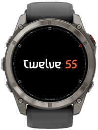            | Asimovian regular              | 80                             |
| 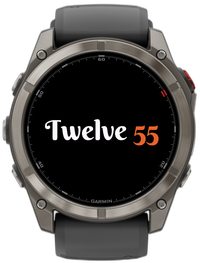       | Berkshire Swash regular        | 90                             |
|           | Caveat Brush regular           | 100                            |
|                | Changa regular                 | 90                             |
|      | Cormorant Unicase bold         | 90                             |
| 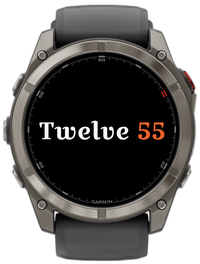         | Croissant One regular          | 80                             |
|                | Delius regular                 | 90                             |
|              | Dyna Puff SemiCondensed regular | 90                             |
|            | Epunda Slab medium             | 90                             |
| 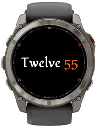           | Fondamento regular             | 90                             |
|      | Gloria Hallelujah regular      | 80                             |
|         | Grenze Gotisch medium          | 100                            |
|               | Handlee regular                | 90                             |
| 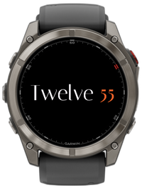             | Italiana regular               | 100                            |
|                  | Jura regular                   | 80                             |
|             | Limelight regular              | 80                             |
| 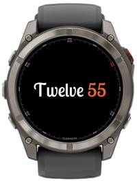           | Lobster Two regular            | 90                             |
|     | Love Ya Like A Sister regular  | 90                             |
|               | Macondo regular                | 90                             |
| 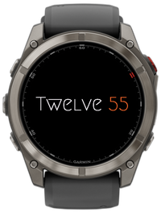               | Megrim regular                 | 80                             |
|              | Merienda regular               | 80                             |
|           | Philosopher bold               | 80                             |
|            | Poetsen One regular            | 80                             |
|        | Quintessential regular         | 100                            |
|           | Rammetto One regular           | 60                             |
|               | Sniglet regular                | 80                             |
| 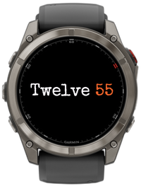         | Special Elite regular          | 80                             |
|        | Stack Sans Notch regular       | 80                             |
|                  | SUSE regular                   | 90                             |
|             | Tenor Sans regular             | 80                             |
|            | Turret Road regular            | 80                             |
| 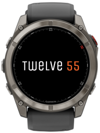             | Unica One regular              | 90                             |
| 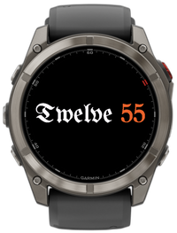   | Unifraktur Maguntia regular    | 100                            |
|            | Yusei Magic regular            | 80                             |

The font development process was as follows:

* The fonts were downloaded from [Google Fonts](https://fonts.google.com/) as True Type  (`.ttf`) fonts.
* The fonts were converted to bitmaps as `.fnt` and `.png` pairs using the open source command-line [`ttf2bmp`](https://github.com/wkusnierczyk/ttf2bmp) converter.
* The font sizes were established to match the Garmin Fenix 7X Solar watch 280x280 pixel screen resolution.
* The fonts were then scaled proportionally to match other screen sizes available on Garmin watches with round screens using the included [utility script](utils/generate_fonts.py).


## Build, test, deploy

To modify and build the sources, you need to have installed:

* [Visual Studio Code](https://code.visualstudio.com/) with [Monkey C extension](https://developer.garmin.com/connect-iq/reference-guides/visual-studio-code-extension/).
* [Garmin Connect IQ SDK](https://developer.garmin.com/connect-iq/sdk/).

Consult [Monkey C Visual Studio Code Extension](https://developer.garmin.com/connect-iq/reference-guides/visual-studio-code-extension/) for how to execute commands such as `build` and `test` to the Monkey C runtime.

You can use the included `Makefile` to conveniently trigger some of the actions from the command line.

```bash
# build binaries from sources
make build

# run unit tests -- note: requires the simulator to be running
make test

# run the simulation
make run

# clean up the project directory
make clean
```

To sideload your application to your Garmin watch, see [developer.garmin.com/connect-iq/connect-iq-basics/your-first-app](https://developer.garmin.com/connect-iq/connect-iq-basics/your-first-app/).
